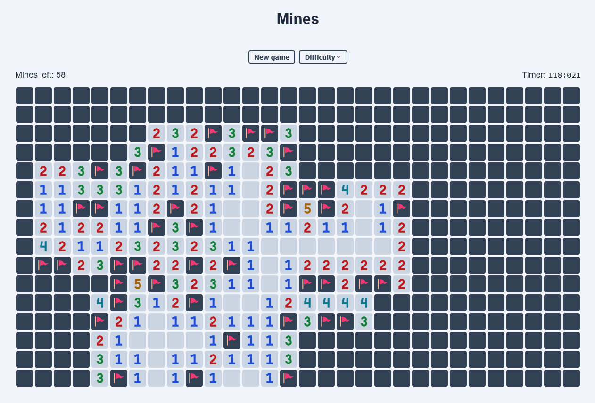

# Mines

[**Открыть онлайн**](https://try-again-later.github.io/Mines/)

Классическая игра Сапёр, написанная на тайпскрипте. Левая кнопка мыши открывает клетки,
правая кнопка мыши ставит флажок. Нажатие обеими кнопками мыши по клетке с цифрами открывает все
соседние клетки, в которых нет мин (если проставлены все флаги).

---

[**Live version**](https://try-again-later.github.io/Mines/)

A classic Minesweeper game written in Typescript. Open cells with the left mouse button,
place flags with the right mouse button. Pressing both mouse buttons over the cell with the digit
reveals every empty neighboring cells (given that all the flags are in place).

## Run locally

```sh
npm install
npm run dev
```

## Demo


## Screenshots


